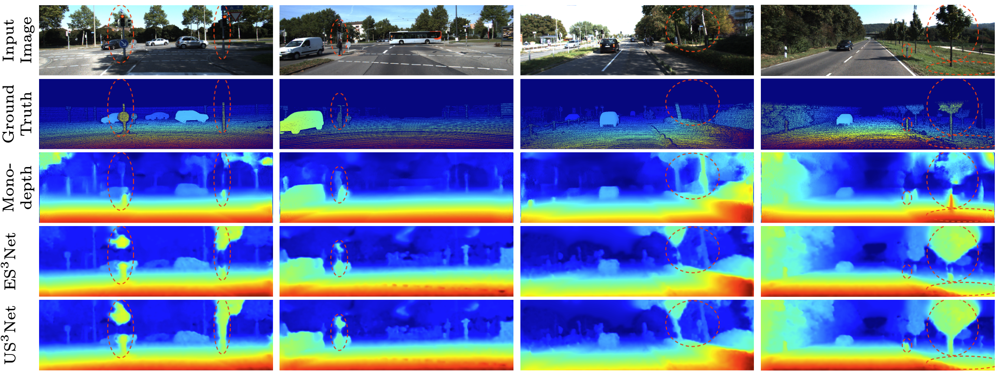

# US³Net: Ultralightweight Self-Supervised Stereo Matching Network using Depth-Aware Geometric Soft Occlusion

## Abstract
US³Net is an ultralightweight self-supervised stereo matching network designed for efficient depth estimation on resource-constrained devices with only 12K parameters. US³Net introduces a low-complexity feature extraction module and a Depth-Aware Geometric Soft Occlusion, DAGSO, strategy to improve stereo matching under occlusions. Experiments on KITTI datasets show that US³Net outperforms previous self-supervised stereo matching and monocular depth estimation methods while reducing the parameter size by 47\% compared with ES³Net (23K), making it suitable for real-time depth estimation on edge devices.

## Comparison of disparity estimation results

Disparity estimation results on KITTI 2015.

## Environment
```Shell
conda create -n US3Net python=3.10
conda activate US3Net

pip install torch==2.3.1 torchvision==0.18.1 torchaudio==2.3.1 --index-url https://download.pytorch.org/whl/cu121
pip install tqdm numpy matplotlib

# For torch_scatter, find torch-2.3.1+cu121 and then download the wheel for torch_scatter-2.1.2+pt23cu121-cp310-cp310-linux_x86_64.whl from https://data.pyg.org/whl/ and install it in this environment.
```


## Train
We use the same data loaders of [ES3Net](https://github.com/IShengFang/ES3Net). Please modify the dataset as these works.
```
python train.py --data_path <dataset path> --dataset <dataset name>
```

## Save Predicted Disparities
### For multiple pairs of images
If you want to test multiple pairs, you need to create two directories, "RGB_left" and "RGB_right", under the main directory.
```
python test.py --load_cpt_path <model checkpoint path> \
               --data_path <dataset path> --save_path <path for saving disparity map>
```
## Pre-trained Model Checkpoint
We provide the pre-trained weight on KITTI training set in this repository.
The filename of checkpoint is `US3Net_kitti_training.cpt`.

```
python evaluate.py --load_cpt_path US3Net_kitti_training.cpt \
                   --data_path <dataset path> 
```
## Citations
```Bibtex
@article{jen2026us,
  title={US $$\^{} 3$$ Net: Ultralightweight Self-Supervised Stereo Matching Network using Depth-Aware Geometric Soft Occlusion},
  author={Jen, Po-Chung and Liu, Tzu-Chi and Fang, I and Wen, Hsiao-Chieh and Hsu, Chia-Lun and Chen, Ping-Yang and Lee, Chang-Hsing and Chen, Yong-Sheng and others},
  journal={International Journal of Computer Vision},
  volume={134},
  number={6},
  pages={286},
  year={2026},
  publisher={Springer}
}
```
## Acknowledgement
This code is based on [ES3Net](https://github.com/IShengFang/ES3Net). We thank the original authors for their excellent works.
